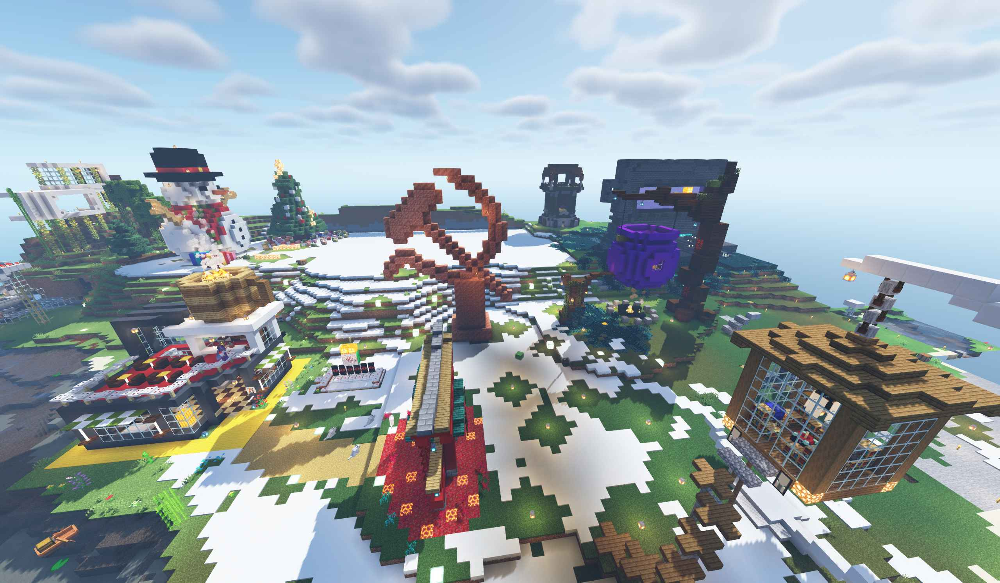

    

# DHU的MC服务器手册

欢迎各位来到DHU的MC服务器！以下为服务器守则，请认真阅读，否则后果自负。

----

### 前言

玩家必须是DHU在籍或已毕业学生，审核标准是本人能否拿出DHU的学生卡或学生证。

服务器旨在为DHUer放松游玩使用，不强制要求玩家进行各类活动。
但是相应的，玩家不可随意进行各种破坏活动。

----

## 服务器提倡的行为 √

#### 建造优雅、美观、的建筑

本项对玩家的要求不高，只要是美观的建筑都可以找一块空地进行建造，
也可以和其他玩家共同合作完成某项中大型建筑，
大型建筑建造前必须先在群里报备并经服主审核通过后方可开工，
否则如果影响机器工作或者扰乱市容，服主有权利拆除此违章建筑

#### 建造实用的机器

建造机器前需在群里询问是否有人已经建造了相同的机器，
防止出现建造了两台相同的机器的尴尬局面。
如有相同类型的机器，若非效率极大提高，否则不必继续建造。
同时也需注意建造的机器是否会对周围的建筑产生不好的影响。
建造完毕后应适当考虑机器的装饰问题（此项非强制但提倡）

#### 建造像素画

像素画生成软件可以在群里找到，使用时需关闭网络。
末地处有混凝土固化机，可以为玩家提供源源不断的各色混凝土，
为像素画的建造打下坚实的后盾。
注意，建造像素画需在玩家活动范围之外建造，
同时也需考虑是否会影响周围机器的运作
（前几天笔者建造的“福”字像素画影响到了袭击塔的运作，
迫不得已向服主申请作弊权限转移像素画的位置，此为前车之鉴）

## 服务器未禁止但不鼓励的行为 ×

#### 随意放置某些意义不明且影响市容的方块

此项规定并不是空穴来风，起因是有人在其他玩家具有一定美观程度的建筑周围
随意搭建一些破环美观的方块用于垫脚或一些意义不明的举动，故出此规定。
希望玩家严格遵守，个人活动结束后的方块及时拆除。

#### 非工业性养殖生物

此项规定也不是空穴来风，有人在玩家们活动范围内圈养了许多监守者，
监守者乱跑，杀死了其他玩家饲养的宠物，干掉了村民交易所的许多村民。
难以处理的监守者对玩家们造成了一定的困扰。
同时，服务器配置较低，难以承受大量的生物活动计算
（尤其是未归巢蜜蜂、有职业的村民等）

#### 建造陷阱，坑害玩家

此项描述的“陷阱”没有明确的界限，虽然合理的陷阱可以增加玩家在游玩时的趣味，
但是过度的陷阱会降低玩家的体验感（如绑定诅咒的南瓜头）。
所以，在建造陷阱前应当仔细斟酌，避免娱乐过度。

#### 损害财产

对于服务器的某些财产，如果不是能量产的，请不要挥霍，如拿钻石块垫脚、装饰等。
对于其他玩家的私有财产，请勿损害。如有被损害，请联系服主解决。

## 服务器明令禁止的行为 ×

#### 破坏机器

玩家建造的机器是服务器的后勤保障，禁止玩家破坏机器。
以下为前车之鉴：
有其他玩家破坏了史莱姆农场，导致效率大幅下降；
潜影贝农场被破坏，导致母贝消失，要想再开机得从千里之外运输潜影贝；
猪人塔收集系统被破坏，笔者挂机了几小时发现没收集到一点金粒……

`Q：要是我不小心弄坏机器了怎么办？`
`A：机器旁边一般有建造者的署名木牌和使用守则，请遵照使用守则使用。若不了解机器，最好不要使用，仅拿取物资。在失误造成机器损坏的情况下，请尝试自己修复（虽然有可能情况变得更糟）更建议请教建造者。无论如何，机器损坏的第一时间应在QQ群里进行报备。`

#### 虐杀其他玩家

服务器开放pvp，仅仅作为娱乐使用，玩家不应虐杀其他玩家。
若有一方厌烦这种行为，请立即停止。

#### 随意跑图

在地图上漫无目的地飞行，会消耗服务器的资源去加载新区块，
导致服务器产生巨额卡顿，影响其他玩家的游戏体验，
同时也会在服务器中产生一些巨大的无用的区域文件，
增大服务器内存压力，加速服务器的宕机。

#### 开挂

服务器命令禁止开挂（如一刀秒杀、物品复制以及一些非原版且未经服主允许的功能等），
对于一些辅助功能，如masa全家桶的功能，服务器不作要求，请合理使用。
 
 
`最终解释权归服主 @浊心的批 所有`
`如有疑惑请在群里询问`

